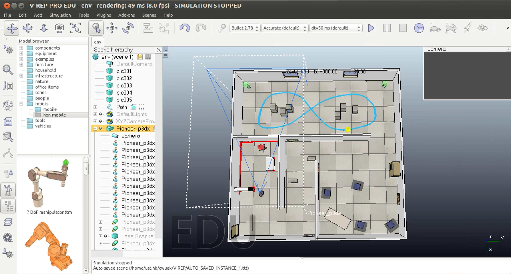
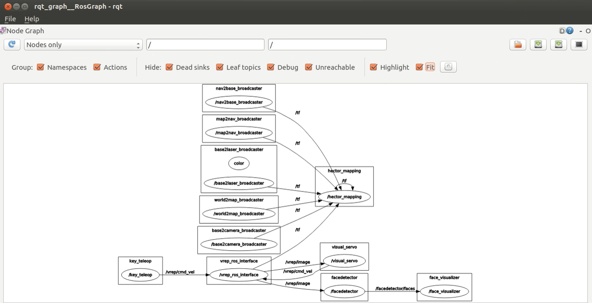
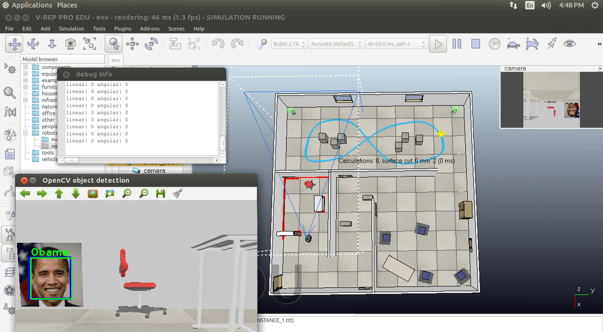

# Robot Operating System (ROS) +robot simulator (V-REP)



* Build 2D grid map with laserscan data avia `rviz`
* Control the mobile robot in the `vrep` simulation environment with keyboard
* Image Recognition and localization
* Visual Servoing (follow the yellow ball)
* roslaunch ros nodes



## SETUP
#### ROS install and catkin
1. Install catkin: http://wiki.ros.org/catkin
2. Install ROS: http://wiki.ros.org/ROS/Installation
3. Configure and create catkin workspace
```
$ echo "source /opt/ros/kinetic/setup.bash" >> ~/.bashrc
$ source ~/.bashrc
$ mkdir -p ~/catkin_ws/src
$ cd ~/catkin_ws/
$ catkin_make
$ echo "source ~/catkin_ws/devel/setup.bash" >> ~/.bashrc
$ source ~/.bashrc
```
4. Install the needed ros packages
```
#install hector slam
$ sudo apt install ros kinetic hector slam
#install key teleop
$ sudo apt install ros kinetic key teleop
```
#### Install V-REP
1. Dowload V-REP: http://www.coppeliarobotics.com/downloads.html
```
$ cp V-REP_PRO_EDU_V3_4_0_Linux.tar.gz ~
$ tar -zvxf ~/V-REP_PRO_EDU_V3_4_0_Linux.tar.gz
$ mkdir ~/V-REP
$ mv ~/V-REP_PRO_EDU_V3_4_0_Linux ~/V-REP
```
#### Load RosInterface and Some Packages
* Copy everything in this repo **except** `README.md env.ttt hector.launch picture/ ` to `~/catkin_ws/src/`
```
$ cd ~/catkin_ws/
$ catkin_make
$ source ~/.bashrc
```
* Copy libv_repExtRosInterface.so
```
$ cd catkin_ws/devel/lib
$ cp libv_repExtRosInterface.so  ~/V-REP
```

## RUN
1. open one terminal and run `$ roscore`
2. open another terminal and run `$ . ~/V-REP/vrep.sh`
>  Please pay attention to these message and if you see 
```
Plugin ’RosInterface’: loading...
Plugin ’RosInterface’: load succeeded.
```
3. open `env.ttt` in vrep's scene and press the start bottom
4. control the robot by keyboard
```
$ rosrun key_teleop key_teleop.py
```
5. launch the ros nodes for face detection/recognition and automatic ball tracking
```
$ roslaunch hector.launch
```





### Credits
* Chien-Sheng (Jason) Wu & Zifan Wang
* This is the final project of the course `ELEC4010K: Machine Learning and Information Processing for Robotic Perception` by Prof. LIU Ming in Fall 2017 at HKUST

